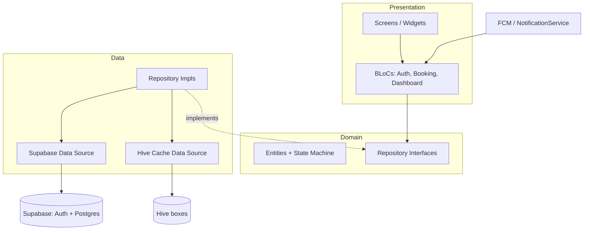
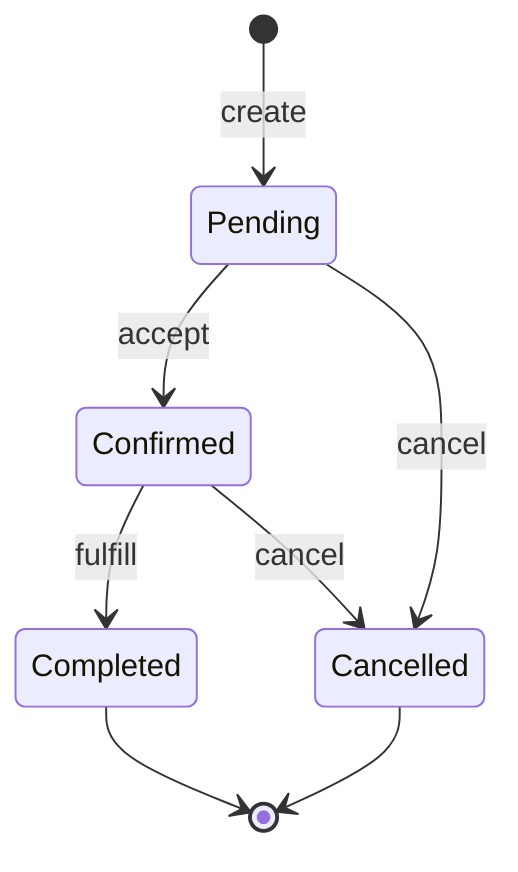
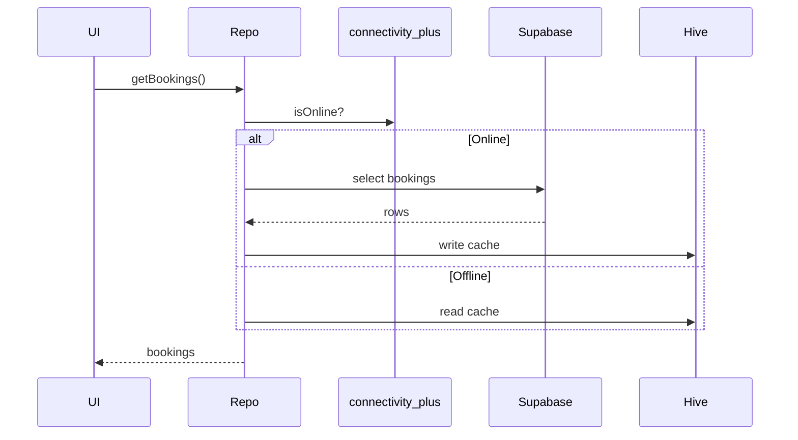
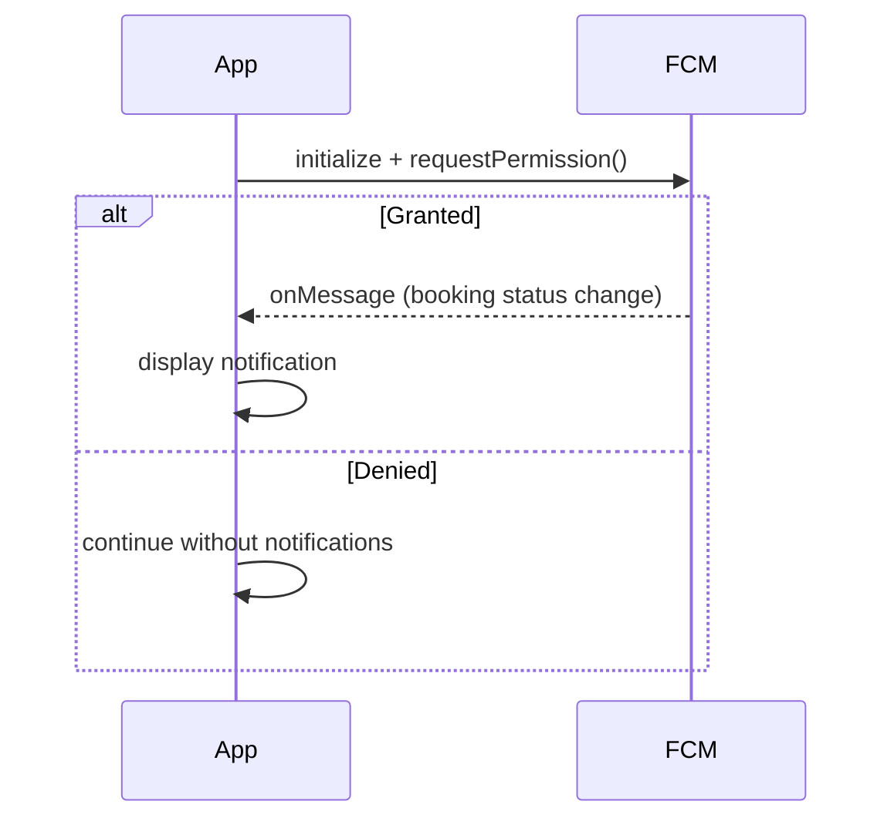

# Design Document

## Overview

Home care nursing booking added to the existing Flutter "cure" app. Users sign in
with Supabase Auth, book a nursing service through a deterministic flow, and track
requests on a dashboard. Data is cached in Hive for offline use, status changes
arrive via Firebase Cloud Messaging, and GitHub Actions runs analyze + test on every
push/PR.

Stack: Clean Architecture (Presentation / Domain / Data), BLoC + freezed for state,
Supabase SDK called directly in data sources, Hive cache, FCM for push.

| Requirement | Covered by |
|---|---|
| 1. Identity & Session | `auth` feature, Supabase Auth, secure session restore |
| 2. Deterministic Booking | `booking` feature, booking state machine |
| 3. Dashboard | `dashboard` feature, summary + lists + pull-to-refresh |
| 4. Offline-First | Hive `Cache_Store`, connectivity_plus sync |
| 5. Push Notifications | `NotificationService`, FCM init + permission |
| 6. CI/CD | GitHub Actions `flutter analyze` + `flutter test` |

## Architecture



Dependencies flow inward: Presentation → Domain ← Data. BLoCs depend on repository
interfaces; repository implementations choose Supabase (online) or Hive (offline).

### Folder Structure

```
lib/
  core/
    di.dart                  # service locator / provider wiring
    connectivity.dart        # connectivity_plus wrapper
    notifications.dart       # NotificationService (FCM)
    error/failures.dart
  features/
    auth/
      data/        auth_remote_datasource.dart, auth_repository_impl.dart
      domain/      auth_repository.dart, user.dart
      presentation/auth_bloc.dart, login_screen.dart, register_screen.dart
    booking/
      data/        booking_remote_datasource.dart, booking_cache_datasource.dart,
                   booking_repository_impl.dart
      domain/      booking.dart (entity + state machine), booking_repository.dart
      presentation/booking_bloc.dart, booking_flow_screen.dart
    dashboard/
      data/        dashboard_repository_impl.dart (reuses booking sources)
      domain/      dashboard_repository.dart, dashboard_summary.dart
      presentation/dashboard_bloc.dart, dashboard_screen.dart
  main.dart
```

## Components and Interfaces

### Data Sources (Supabase SDK called directly)

```dart
class BookingRemoteDataSource {
  final SupabaseClient client;
  Future<List<BookingModel>> fetchBookings(String userId) async {
    final rows = await client.from('bookings').select().eq('user_id', userId);
    return rows.map(BookingModel.fromJson).toList();
  }
  Future<BookingModel> createBooking(BookingModel b) async {
    final row = await client.from('bookings').insert(b.toJson()).select().single();
    return BookingModel.fromJson(row);
  }
  Future<BookingModel> updateStatus(String id, BookingStatus s) async { /* update + select */ }
  Future<List<ServiceModel>> fetchServices() async { /* from('services').select() */ }
}
```

### Repositories (offline-first orchestration)

```dart
abstract class BookingRepository {
  Future<List<Booking>> getBookings();      // online -> cache; offline -> cache
  Future<Booking> createBooking(BookingDraft d);
  Future<Booking> cancelBooking(String id);
  Future<List<Service>> getServices();
}
```

`BookingRepositoryImpl` checks connectivity: if online, read Supabase then write Hive;
if offline, read Hive. Writes go to Supabase when online and update the cache.

### BLoCs (freezed states/events)

```dart
@freezed
sealed class BookingState with _$BookingState {
  const factory BookingState.initial() = _Initial;
  const factory BookingState.loading() = _Loading;
  const factory BookingState.success(List<Booking> bookings) = _Success;
  const factory BookingState.error(String message) = _Error;
}
```

Three BLoCs: `AuthBloc` (register/login/restore/signOut), `BookingBloc`
(loadServices/createBooking/cancelBooking), `DashboardBloc` (load/refresh).

## Data Models

### Supabase Tables

`services`
| column | type | notes |
|---|---|---|
| id | uuid PK | |
| name | text | clinical service name |
| description | text | |
| available_slots | jsonb | dates/times for availability |

`bookings`
| column | type | notes |
|---|---|---|
| id | uuid PK | |
| user_id | uuid FK → auth.users | RLS: owner only |
| service_id | uuid FK → services | |
| scheduled_date | timestamptz | |
| remarks | text | patient clinical remarks |
| status | text | pending \| confirmed \| completed \| cancelled |
| created_at | timestamptz | default now() |

Row Level Security restricts each user to rows where `user_id = auth.uid()`.

### Booking State Machine



Cancel is allowed only from Pending or Confirmed. Cancel from Completed/Cancelled is
rejected and the state is unchanged (Req 2.7). The transition rule lives in the
`Booking` domain entity:

```dart
bool get canCancel =>
    status == BookingStatus.pending || status == BookingStatus.confirmed;
```

## Hive Caching Strategy (Offline-First)



- Boxes: `bookings_box` (booking list), `dashboard_box` (summary snapshot).
- Read: online fetches Supabase and overwrites cache; offline returns cached data.
- Write/sync: when connectivity is restored, repository re-fetches Supabase and
  refreshes the boxes. `flutter_secure_storage` holds the Supabase session token.

## FCM Flow (Push Notifications)



`NotificationService` initializes FCM at startup, requests permission, and listens for
foreground/background messages. Denied permission is non-fatal (Req 5.3).

## Error Handling

- Data sources throw on Supabase/network failure; repositories catch and fall back to
  cache (reads) or surface a `Failure`.
- BLoCs map failures to `BookingState.error(message)` / `AuthState.error(message)`.
- Auth: invalid/incomplete credentials produce an error state with a user-facing
  message (Req 1.3); no session is started.
- Booking: invalid cancel (Completed/Cancelled) is rejected before any remote call.

## Dependencies to Add

`supabase_flutter`, `flutter_bloc`, `freezed_annotation`, `json_annotation`,
`hive`, `hive_flutter`, `connectivity_plus`, `flutter_secure_storage`.
Dev: `build_runner`, `freezed`, `json_serializable`, `hive_generator`.
(`firebase_core`, `firebase_messaging` already present.)

## CI/CD (GitHub Actions)

`.github/workflows/ci.yml` — runs on push and pull_request:

```yaml
on: [push, pull_request]
jobs:
  build:
    runs-on: ubuntu-latest
    steps:
      - uses: actions/checkout@v4
      - uses: subosito/flutter-action@v2
        with: { channel: stable }
      - run: flutter pub get
      - run: dart run build_runner build --delete-conflicting-outputs
      - run: flutter analyze
      - run: flutter test
```

A failure in `flutter analyze` or `flutter test` fails the job (Req 6.3). No hosting
or deployment steps.

## Correctness Properties

*A property is a characteristic or behavior that should hold true across all valid
executions of the system — a formal, machine-verifiable statement of what the system
should do.*

### Property 1: Invalid credentials are rejected without a session

*For any* credential pair that is empty, incomplete, or malformed, the Auth_Service
SHALL reject the attempt with an error state and SHALL NOT start a Session.

**Validates: Requirements 1.3**

### Property 2: New bookings start in Pending

*For any* valid booking draft, the Booking created by the Booking_Service SHALL have
status Pending.

**Validates: Requirements 2.3**

### Property 3: Valid lifecycle transitions

*For any* Pending booking, accepting it SHALL produce Confirmed; *for any* Confirmed
booking, fulfilling it SHALL produce Completed.

**Validates: Requirements 2.4, 2.5**

### Property 4: Cancel validity

*For any* booking in Pending or Confirmed, cancelling SHALL produce Cancelled; *for
any* booking in Completed or Cancelled, cancelling SHALL be rejected and the status
SHALL remain unchanged.

**Validates: Requirements 2.6, 2.7**

### Property 5: Summary counts are consistent

*For any* list of bookings, the dashboard summary counts (active, completed,
cancelled) SHALL equal the tally of bookings in each category and SHALL sum to the
total number of bookings.

**Validates: Requirements 3.1**

### Property 6: Active/history partition is complete and disjoint

*For any* list of bookings, the active-requests list and the booking-history list
SHALL together contain every booking exactly once with no overlap.

**Validates: Requirements 3.2**

### Property 7: Cache round-trip

*For any* booking list fetched from Supabase, writing it to the Cache_Store and then
reading it back SHALL return an equivalent list.

**Validates: Requirements 4.1**

### Property 8: Offline reads return cached data

*For any* cached booking list, while the device is offline the App SHALL return that
cached list unchanged.

**Validates: Requirements 4.2**

## Testing Strategy

- **Property tests** (min. 100 iterations each) cover Properties 1–8 using generated
  inputs, tagged `Feature: home-care-nursing-booking, Property {n}: {text}`.
- **Unit/example tests** cover session restore/sign-out (1.4, 1.5), availability
  display (2.2), and permission-denied handling (5.3).
- **Integration tests** (1–3 examples, mocked Supabase/FCM) cover auth calls (1.1,
  1.2), service fetch (2.1), pull-to-refresh sync (3.4), reconnect sync (4.3), and
  notification display (5.2).
- **Smoke tests** verify FCM init at startup (5.1) and CI workflow presence (6.1–6.3).
